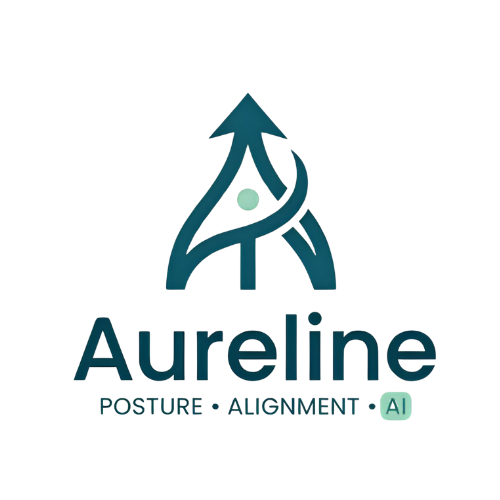
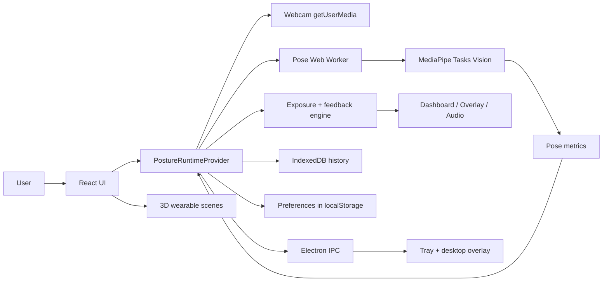
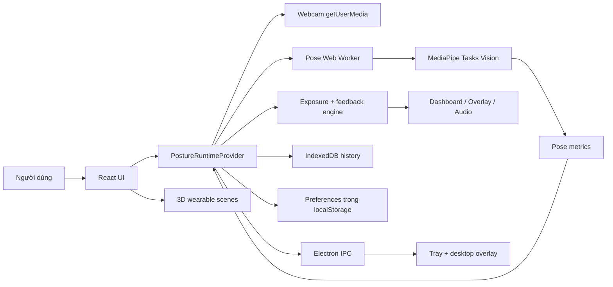

# AureLine | AI Posture Coach

> A local-first posture coaching application that combines real-time camera posture analysis, personalized feedback, recovery guidance, daily analytics, and an interactive wearable product concept.



## Demo

> If GitHub does not render the embedded GIF in your browser, open it directly: [assets/AureLine_App.gif](assets/AureLine_App.gif).


## Table of Contents

- [English](#english)
- [Tiếng Việt](#tiếng-việt)

---

## English

### Overview

AureLine is a desktop-first AI posture coach for students, developers, office workers, and long-session computer users. The app uses the local webcam to estimate posture in real time, calibrates a personal baseline, detects posture load, gives respectful feedback, and turns posture correction into a trackable daily habit.

The project is intentionally local-first:

- Camera frames are processed locally in the browser/Electron runtime.
- MediaPipe inference runs inside a Web Worker so the UI stays responsive.
- Runtime history is persisted locally with IndexedDB.
- Preferences are persisted locally with `localStorage`.
- No backend is required for the core experience.

This is not a medical treatment device. It is an ergonomic posture coaching and wellness-support prototype.

### Core Features

| Area | What it does |
| --- | --- |
| Landing page | Introduces AureLine, simulated camera coaching, posture analytics, privacy positioning, and the wearable concept. |
| Live dashboard | Starts webcam tracking, calibrates posture baseline, renders skeleton overlay, live score, coach copy, distance advisory, feedback history, and wearable companion preview. |
| Runtime posture engine | Computes head-forward, torso-lean, shoulder-tilt, side-camera view, distance status, exposure load, static-hold load, recovery state, and live score. |
| Feedback modes | Supports visual-only cues, soft audio cues, and supportive voice cues for posture warnings, timed breaks, distance advisories, and correction rewards. |
| Daily report | Shows daily posture summaries, focus trends, sitting distribution, recent reminders, and sample/demo history when real history is unavailable. |
| Recovery page | Recommends recovery flows based on live issue, distance cue, static hold/load, break reminder, or latest local summary. |
| Settings | Controls sensitivity, feedback mode, reminder cadence, theme, camera source, landmark policy, privacy toggles, and reminder toggles. |
| Desktop shell | Electron main window, tray behavior, quit-flush protocol, and full-screen overlay reminders for high-severity posture cues. |
| Wearable page | Interactive 3D product page for the simulated posture harness and its haptic zones. |
| Wearable companion | Dashboard-side 3D preview of the future wearable. It defaults to "not connected" until hardware pairing exists. |
| Localization | English and Vietnamese content with a typed locale schema. |

### Technology Stack

| Layer | Technology |
| --- | --- |
| Desktop shell | Electron 41 |
| Frontend | React 19, TypeScript, Vite 7 |
| Routing | React Router DOM |
| Styling | Tailwind CSS v4, custom CSS system, Radix UI primitives, Lucide icons |
| Motion | Framer Motion |
| Charts | Recharts |
| 3D | Three.js, React Three Fiber, Drei, React Three Postprocessing |
| AI / vision | `@mediapipe/tasks-vision`, local MediaPipe models and WASM assets |
| Worker runtime | Web Worker for pose inference |
| Persistence | IndexedDB via `idb`, browser `localStorage` |
| Testing | Vitest, jsdom, fake-indexeddb |

### Architecture



### Runtime Data Flow

1. The user starts monitoring from the dashboard.
2. The app initializes the MediaPipe worker and requests webcam permission.
3. The runtime captures frames at `TARGET_CAPTURE_FPS = 10`.
4. Frames are transferred to the worker as `ImageBitmap` objects.
5. MediaPipe returns pose landmarks.
6. `pose-metrics.ts` validates landmarks and computes posture metrics.
7. The runtime calibrates a personal baseline, then builds sensitivity-based thresholds.
8. `exposure-engine.ts` calculates instant posture state, issue family, exposure load, static hold, and recovery.
9. `feedback-engine.ts` decides when to trigger level 2/3/4 posture feedback.
10. The dashboard renders live status, the audio layer plays the selected feedback mode, and Electron can show a desktop overlay for severe cues.
11. Session samples, events, summaries, achievements, and recovery activity are persisted locally.

### Project Structure

```text
.
├── assets/                         # README/demo assets
│   └── AureLine_App.gif
├── electron/                       # Electron main/preload process
├── public/
│   ├── logo_aureline.png
│   ├── logo_app.png
│   ├── mediapipe/wasm/             # Local MediaPipe WASM runtime
│   └── models/                     # Pose model, holistic model, wearable GLB
├── src/
│   ├── components/
│   │   ├── cyber/                  # App shell, cards, buttons, metric UI
│   │   ├── shared/                 # Language provider, toggles, error boundary
│   │   └── wearable/               # 3D wearable model, scene state, companion
│   ├── locales/                    # EN/VI content and schema
│   ├── pages/                      # Landing, dashboard, report, recovery, settings, overlay, wearable
│   ├── runtime/                    # Camera, worker, metrics, scoring, feedback, storage, tests
│   └── types/                      # Shared product/UI types
├── documents/                      # Internal architecture and concept notes
├── package.json
└── vite.config.ts
```

### Getting Started

#### Requirements

- Node.js 20.19+ or 22.12+ recommended for Vite 7.
- npm 10+ recommended.
- A modern Chromium-based browser or Electron runtime with webcam access.
- A webcam for live posture monitoring.

#### Install

```bash
npm install
```

#### Run web development server

```bash
npm run dev
```

Open the Vite URL shown in the terminal, usually:

```text
http://localhost:5173
```

#### Run desktop development mode

```bash
npm run desktop:dev
```

This starts Vite, watches the Electron TypeScript build, and launches Electron against the local dev server.

#### Build

```bash
npm run build
```

This compiles TypeScript, builds Electron files into `dist-electron/`, and builds the renderer into `dist/`.

#### Start desktop production build locally

```bash
npm run desktop:start
```

#### Preview production renderer

```bash
npm run preview
```

### Test Commands

```bash
npm test
```

Useful targeted runtime checks:

```bash
npm exec vitest run src/runtime/feedback-engine.test.ts src/runtime/preferences.test.ts src/runtime/posture-runtime-provider.integration.test.tsx
```

Current note: the full test suite includes `src/components/wearable/wearable-asset.test.ts`, which validates the 3D wearable GLB contract. It will fail until `public/models/model3D.glb` is re-exported with the required named meshes and hotspot marker nodes.

### 3D Wearable Asset Contract

The 3D product experience expects `public/models/model3D.glb` to include named parts and marker nodes. This lets the UI attach hotspots and highlights to real product geometry instead of guessing positions.

Required product part nodes:

- `CoreModule`
- `ShoulderStrap_L`
- `ShoulderStrap_R`
- `FrontStabilizationStrap`
- `AdaptiveSupport_L`
- `AdaptiveSupport_R`

Required hotspot marker nodes:

- `Hotspot_CoreModule`
- `Hotspot_LeftShoulder`
- `Hotspot_RightShoulder`
- `Hotspot_FrontStrap`
- `Hotspot_AdaptiveSupport`

Recommended focus marker nodes:

- `Focus_CoreModule`
- `Focus_Shoulders`
- `Focus_FrontStrap`
- `Focus_AdaptiveSupport`

### Privacy and Data Handling

- No backend is required.
- Camera frames are not persisted.
- Webcam frames are processed locally by the browser/Electron runtime.
- Pose samples are reduced to rounded posture metrics and selected landmarks.
- Runtime history, events, daily summaries, achievements, and recovery activity are stored locally in IndexedDB.
- User preferences are stored locally in `localStorage`.

### GitHub Publishing Notes

- `assets/AureLine_App.gif` is about 86 MB, which is under GitHub's 100 MB single-file limit.
- Future large videos, 3D assets, or model files above 100 MB should use Git LFS.
- `dist/`, `dist-electron/`, `node_modules/`, and TypeScript build caches are intentionally ignored.
- `public/mediapipe/wasm/` and `public/models/*.task` should stay committed because the runtime depends on local AI assets.

### Roadmap Ideas

- Re-export the wearable GLB with the complete asset contract.
- Add a real wearable pairing state once hardware integration exists.
- Add packaged Electron release scripts.
- Add CI for build, runtime tests, and asset validation.
- Add optional model/provider configuration if a backend is introduced later.

---

## Tiếng Việt

### Tổng quan

AureLine là ứng dụng AI posture coach ưu tiên desktop, dành cho sinh viên, lập trình viên, nhân viên văn phòng và người thường xuyên ngồi lâu trước máy tính. Ứng dụng dùng webcam local để phân tích tư thế theo thời gian thực, hiệu chỉnh baseline cá nhân, phát hiện tải tư thế, đưa ra nhắc nhở đúng lúc, đề xuất bài phục hồi và biến việc chỉnh tư thế thành một thói quen có thể theo dõi mỗi ngày.

Dự án được thiết kế theo hướng local-first:

- Frame camera được xử lý cục bộ trong browser/Electron runtime.
- MediaPipe chạy trong Web Worker để giao diện không bị lag.
- Lịch sử runtime được lưu cục bộ bằng IndexedDB.
- Cài đặt người dùng được lưu cục bộ bằng `localStorage`.
- Core experience không cần backend.

Dự án này không phải thiết bị điều trị y khoa. Đây là prototype hỗ trợ ergonomic posture coaching và wellness.

### Chức năng chính

| Khu vực | Chức năng |
| --- | --- |
| Landing page | Giới thiệu AureLine, mô phỏng camera coaching, analytics, privacy và concept wearable. |
| Dashboard trực tiếp | Bật webcam, calibration baseline, skeleton overlay, live score, coach copy, distance advisory, lịch sử phản hồi và wearable companion preview. |
| Runtime posture engine | Tính forward-head, torso-lean, shoulder-tilt, side-camera view, khoảng cách màn hình, exposure load, static hold, recovery và live score. |
| Kiểu phản hồi | Hỗ trợ nhắc bằng hình ảnh, âm báo nhẹ và giọng nhắc hỗ trợ cho cảnh báo tư thế, nhắc nghỉ, cảnh báo khoảng cách và reward khi chỉnh tốt. |
| Báo cáo ngày | Hiển thị summary theo ngày, trend tập trung, phân bổ thời gian ngồi, nhắc nhở gần đây và dữ liệu sample khi chưa có lịch sử thật. |
| Phục hồi | Đề xuất bài tập dựa trên lỗi đang xảy ra, distance cue, static hold/load, break reminder hoặc summary local mới nhất. |
| Cài đặt | Điều chỉnh sensitivity, feedback mode, reminder cadence, theme, camera source, landmark policy, privacy toggle và reminder toggle. |
| Desktop shell | Electron main window, tray behavior, quit-flush protocol và overlay toàn màn hình cho cue nặng. |
| Trang wearable | Trang 3D product cho dây đai tư thế và các vùng haptic. |
| Wearable companion | Preview 3D thiết bị trên dashboard. Mặc định là “chưa kết nối” cho tới khi có hardware pairing thật. |
| Đa ngôn ngữ | Nội dung tiếng Anh và tiếng Việt với locale schema rõ ràng. |

### Công nghệ sử dụng

| Lớp | Công nghệ |
| --- | --- |
| Desktop shell | Electron 41 |
| Frontend | React 19, TypeScript, Vite 7 |
| Routing | React Router DOM |
| Styling | Tailwind CSS v4, custom CSS system, Radix UI primitives, Lucide icons |
| Motion | Framer Motion |
| Charts | Recharts |
| 3D | Three.js, React Three Fiber, Drei, React Three Postprocessing |
| AI / vision | `@mediapipe/tasks-vision`, MediaPipe model và WASM chạy local |
| Worker runtime | Web Worker cho pose inference |
| Persistence | IndexedDB qua `idb`, browser `localStorage` |
| Testing | Vitest, jsdom, fake-indexeddb |

### Kiến trúc tổng thể



### Luồng xử lý runtime

1. Người dùng bấm bắt đầu theo dõi trên dashboard.
2. Ứng dụng khởi tạo MediaPipe worker và xin quyền camera.
3. Runtime capture frame ở `TARGET_CAPTURE_FPS = 10`.
4. Frame được gửi sang worker dưới dạng `ImageBitmap`.
5. MediaPipe trả về pose landmarks.
6. `pose-metrics.ts` validate landmark và tính posture metrics.
7. Runtime calibration baseline cá nhân, sau đó tạo threshold theo sensitivity.
8. `exposure-engine.ts` tính posture state tức thời, issue family, exposure load, static hold và recovery.
9. `feedback-engine.ts` quyết định khi nào phát posture feedback level 2/3/4.
10. Dashboard render live status, audio layer phát mode đã chọn, Electron có thể hiện overlay desktop cho cue nặng.
11. Session samples, events, summaries, achievements và recovery activity được lưu cục bộ.

### Cấu trúc dự án

```text
.
├── assets/                         # Asset cho README/demo
│   └── AureLine_App.gif
├── electron/                       # Electron main/preload process
├── public/
│   ├── logo_aureline.png
│   ├── logo_app.png
│   ├── mediapipe/wasm/             # MediaPipe WASM local
│   └── models/                     # Pose model, holistic model, wearable GLB
├── src/
│   ├── components/
│   │   ├── cyber/                  # App shell, card, button, metric UI
│   │   ├── shared/                 # Language provider, toggle, error boundary
│   │   └── wearable/               # 3D wearable model, scene state, companion
│   ├── locales/                    # Nội dung EN/VI và schema
│   ├── pages/                      # Landing, dashboard, report, recovery, settings, overlay, wearable
│   ├── runtime/                    # Camera, worker, metrics, scoring, feedback, storage, tests
│   └── types/                      # Shared product/UI types
├── documents/                      # Ghi chú kiến trúc và concept nội bộ
├── package.json
└── vite.config.ts
```

### Cài đặt và chạy dự án

#### Yêu cầu

- Node.js 20.19+ hoặc 22.12+ khuyến nghị cho Vite 7.
- npm 10+ khuyến nghị.
- Browser Chromium hiện đại hoặc Electron runtime có quyền webcam.
- Webcam để dùng live posture monitoring.

#### Cài dependencies

```bash
npm install
```

#### Chạy web dev server

```bash
npm run dev
```

Mở URL Vite hiển thị trong terminal, thường là:

```text
http://localhost:5173
```

#### Chạy desktop development mode

```bash
npm run desktop:dev
```

Lệnh này chạy Vite, watch Electron TypeScript build và mở Electron bằng local dev server.

#### Build production

```bash
npm run build
```

Lệnh này compile TypeScript, build Electron vào `dist-electron/` và build renderer vào `dist/`.

#### Mở desktop production build local

```bash
npm run desktop:start
```

#### Preview renderer production

```bash
npm run preview
```

### Kiểm thử

```bash
npm test
```

Một số test runtime nên chạy khi chỉnh logic posture/feedback:

```bash
npm exec vitest run src/runtime/feedback-engine.test.ts src/runtime/preferences.test.ts src/runtime/posture-runtime-provider.integration.test.tsx
```

Lưu ý hiện tại: full test suite có `src/components/wearable/wearable-asset.test.ts` để validate contract của file 3D wearable. Test này sẽ fail cho tới khi `public/models/model3D.glb` được re-export với đầy đủ named meshes và hotspot marker nodes.

### Contract cho asset 3D wearable

Trải nghiệm 3D product cần `public/models/model3D.glb` có named parts và marker nodes. Điều này giúp UI gắn hotspot/highlight vào đúng geometry thật, không phải đoán theo bounding box.

Các node part bắt buộc:

- `CoreModule`
- `ShoulderStrap_L`
- `ShoulderStrap_R`
- `FrontStabilizationStrap`
- `AdaptiveSupport_L`
- `AdaptiveSupport_R`

Các hotspot marker bắt buộc:

- `Hotspot_CoreModule`
- `Hotspot_LeftShoulder`
- `Hotspot_RightShoulder`
- `Hotspot_FrontStrap`
- `Hotspot_AdaptiveSupport`

Các focus marker nên có:

- `Focus_CoreModule`
- `Focus_Shoulders`
- `Focus_FrontStrap`
- `Focus_AdaptiveSupport`

### Quyền riêng tư và dữ liệu

- Không cần backend.
- Không persist frame camera.
- Frame webcam được xử lý local trong browser/Electron runtime.
- Pose sample được rút gọn thành posture metrics và một phần landmark đã làm tròn.
- Runtime history, events, daily summaries, achievements và recovery activity được lưu local trong IndexedDB.
- Preferences được lưu local trong `localStorage`.

### Ghi chú khi public lên GitHub

- `assets/AureLine_App.gif` khoảng 86 MB, dưới giới hạn 100 MB/file của GitHub.
- Nếu sau này có video, 3D asset hoặc model file lớn hơn 100 MB, nên dùng Git LFS.
- `dist/`, `dist-electron/`, `node_modules/` và TypeScript cache đã được ignore.
- `public/mediapipe/wasm/` và `public/models/*.task` nên được commit vì runtime phụ thuộc vào local AI assets.

### Roadmap gợi ý

- Re-export wearable GLB theo đúng asset contract.
- Thêm trạng thái ghép đôi thiết bị thật khi có hardware integration.
- Thêm script đóng gói Electron release.
- Thêm CI cho build, runtime tests và asset validation.
- Thêm cấu hình backend/model provider nếu sau này cần đồng bộ cloud.
