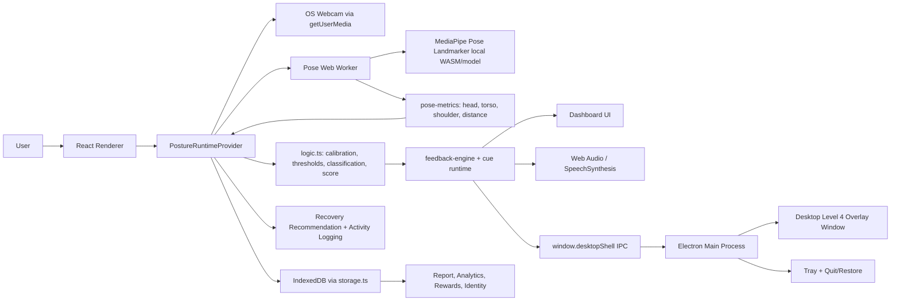
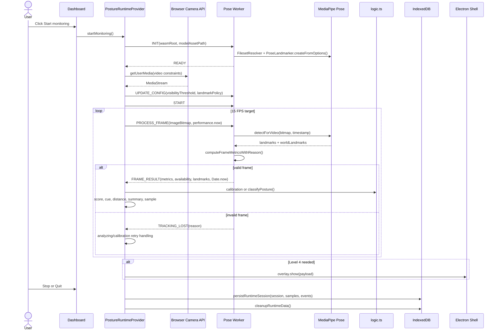
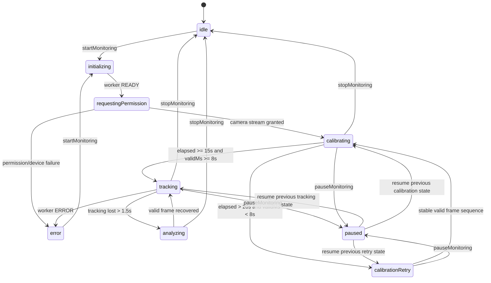
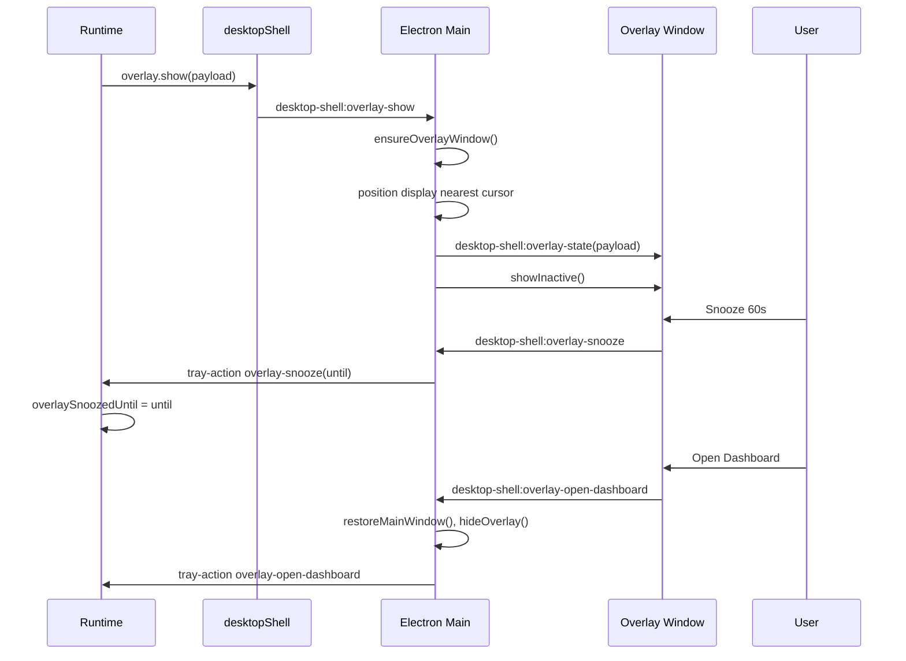
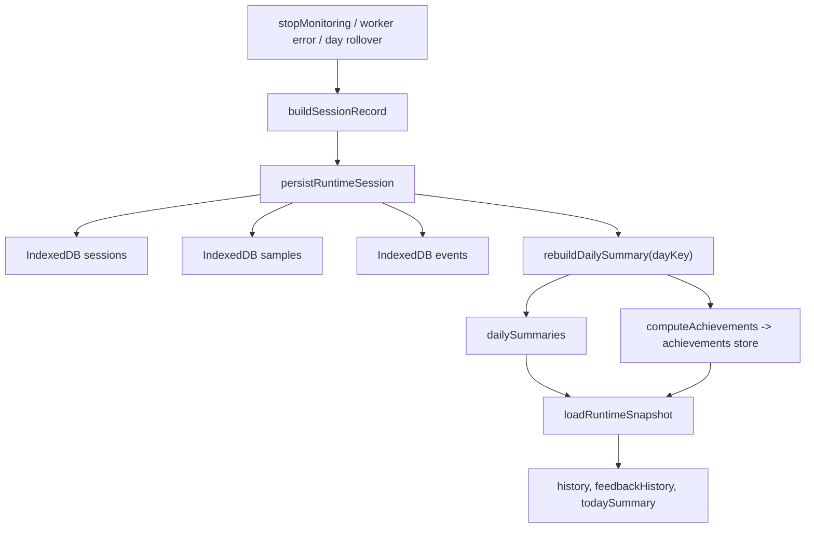

# AI Posture Coach - System Architecture

> Generated from source review of `D:\Code\AI_Posture_Coach`.

## 1. Executive Summary

AI Posture Coach là ứng dụng desktop-first dùng Electron + React/Vite. Mục tiêu chính là theo dõi tư thế người dùng bằng webcam, chạy MediaPipe Pose Landmarker trên máy local, hiệu chỉnh baseline cá nhân, phân loại tư thế theo thời gian thực, phát feedback theo cấp độ, tính posture score, lưu dữ liệu cục bộ và hiển thị dashboard/report/recovery flow.

Sản phẩm hiện tại không phụ thuộc backend. Video frame chỉ được xử lý trong runtime và worker, không lưu xuống IndexedDB. Dữ liệu được lưu chỉ gồm preferences, session records, sampled keypoints đã làm tròn, posture events, daily summaries, achievements và recovery activity metadata.

## 2. Technology Stack

| Layer | Technology | Vai trò |
| --- | --- | --- |
| Desktop shell | Electron 41 | Main window, tray lifecycle, desktop Level 4 overlay, IPC bridge |
| Renderer | React 19, TypeScript, Vite 7 | UI, route rendering, runtime provider, camera stream handling |
| Routing | React Router DOM | BrowserRouter cho web dev, HashRouter khi chạy trong Electron |
| Pose AI | `@mediapipe/tasks-vision` | Pose Landmarker `VIDEO` mode, `numPoses = 1`, local model/WASM |
| Inference isolation | Web Worker | MediaPipe inference ngoài main UI thread |
| Persistence | IndexedDB via `idb`, localStorage | Runtime history local-first và preferences local |
| Charts | Recharts | Dashboard/report trends, pie/bar/line charts |
| UI primitives | Radix UI, Lucide, Tailwind CSS v4, custom CSS | Card, button, slider, switch, theme, icons |
| Motion | Framer Motion | Reward/break UI transition |
| Tests | Vitest, jsdom, fake-indexeddb | Unit/integration tests cho runtime logic và shell policy |

## 3. Source Map

| Path | Vai trò |
| --- | --- |
| `electron/main.ts` | Tạo BrowserWindow chính, tray, overlay window, IPC channel, quit flush protocol |
| `electron/preload.ts` | Expose `window.desktopShell` an toàn cho renderer qua `contextBridge` |
| `electron/shell-policy.ts` | Policy nhỏ cho hide-to-tray và quit fallback timeout |
| `src/main.tsx` | React bootstrap, chọn BrowserRouter hoặc HashRouter |
| `src/App.tsx` | Route tree, theme state, overlay-window branch, mount `PostureRuntimeProvider` cho app routes |
| `src/runtime/posture-runtime-provider.tsx` | Orchestrator lớn nhất của runtime: camera, worker, calibration, score, feedback, persistence, diagnostics |
| `src/runtime/pose-worker.ts` | Worker init MediaPipe, receive frame bitmap, return frame metrics/tracking lost/error |
| `src/runtime/pose-metrics.ts` | Landmark validation, metric calculation, stored landmark subset |
| `src/runtime/logic.ts` | Thresholds, classification, score, daily summary, streak, achievements, identity |
| `src/runtime/storage.ts` | IndexedDB schema, persistence, cleanup, snapshot loading |
| `src/runtime/preferences.ts` | localStorage preferences và default preferences |
| `src/runtime/feedback-engine.ts` | Feedback level selection và escalation/cooldown rule |
| `src/runtime/recovery.ts` | Recovery recommendation helper và recovery seconds aggregation |
| `src/runtime/time.ts` | Frame delta safety helper |
| `src/pages/*` | Route-level pages: landing, dashboard, report, recovery, settings, overlay |
| `src/components/dashboard/*` | Live monitor, status, analytics, health, feedback history, rewards |
| `src/components/reports/*` | Daily report UI, insights, no-data state |
| `src/components/settings/*` | Camera, feedback, privacy/local-processing settings |
| `src/components/exercises/*` | Recovery grid và guided recovery timer flow |
| `src/locales/*` | EN/VI content schema và localized copy |
| `public/mediapipe/wasm/*` | Local MediaPipe WASM assets |
| `public/models/pose_landmarker_lite.task` | Local Pose Landmarker model asset |

## 4. High-Level Architecture



## 5. Process Architecture

### 5.1 Electron Main Process

`electron/main.ts` quản lý các phần native không nên đặt trực tiếp trong renderer.

| Concern | Implementation |
| --- | --- |
| Main window | `BrowserWindow` 1480x980, min 1180x760, auto-hide menu, preload `preload.js`, `backgroundThrottling: false` |
| Default route | `getRendererUrl("/dashboard", "main")`, dev dùng `VITE_DEV_SERVER_URL`, production dùng `dist/index.html` |
| Tray | SVG tray icon, context menu `Open Dashboard` và `Quit`, double-click restore |
| Hide-to-tray | `shouldHideWindowToTray(monitoringActive)` chỉ hide khi renderer báo monitoring active |
| Overlay | Fullscreen, frameless, transparent, skipTaskbar, always-on-top screen-saver layer, display gần cursor nhất |
| Overlay material | Gọi `setBackgroundMaterial("acrylic")`; nếu không support thì fallback dim overlay |
| Quit protocol | Main broadcast `{type:"quit"}`, renderer flush session rồi gọi `notifyQuitReady`; main có fallback 10s |

### 5.2 Preload Bridge

`electron/preload.ts` expose API an toàn qua `contextBridge`.

| API | Direction | Purpose |
| --- | --- | --- |
| `desktopShell.overlay.show(payload)` | Renderer -> Main | Show Level 4 overlay |
| `desktopShell.overlay.hide()` | Renderer -> Main | Hide overlay |
| `desktopShell.overlay.snooze()` | Overlay renderer -> Main | Snooze 60s |
| `desktopShell.overlay.openDashboard()` | Overlay renderer -> Main | Restore dashboard và hide overlay |
| `desktopShell.overlay.onState(listener)` | Main -> Overlay renderer | Sync overlay payload |
| `desktopShell.tray.onAction(listener)` | Main -> Renderer | Restore, quit, overlay snooze/open-dashboard events |
| `desktopShell.window.restore()` | Renderer -> Main | Restore main window |
| `desktopShell.window.setMonitoringActive(active)` | Renderer -> Main | Main biết khi nào hide-to-tray |
| `desktopShell.window.notifyQuitReady()` | Renderer -> Main | Ack đã flush session trước khi quit |

## 6. Renderer Architecture

### 6.1 App Bootstrap

`src/main.tsx` chọn router dựa trên môi trường.

| Runtime | Router |
| --- | --- |
| Browser dev, không có `window.desktopShell` | `BrowserRouter` |
| Electron renderer, có `window.desktopShell` | `HashRouter` |

`src/App.tsx` định nghĩa route tree.

| Route | Page | Provider |
| --- | --- | --- |
| `/` | LandingPage | Có runtime provider trong route tree |
| `/dashboard` | DashboardPage | Có runtime |
| `/report` | ReportPage | Có runtime |
| `/recovery` | ExercisesPage | Có runtime |
| `/settings` | SettingsPage | Có runtime |
| `/overlay` hoặc `?window=overlay` | OverlayPage | Overlay-window branch không mount runtime |

Theme state nằm ở `App`, gồm `midnight`, `pearl`, `system`. Ngôn ngữ nằm ở `LanguageProvider`.

### 6.2 Runtime Context Contract

`PostureRuntimeProvider` expose các nhóm state chính.

| Group | Fields |
| --- | --- |
| Monitoring | `monitoringStatus`, `cameraMode`, `postureState`, `runtimeError` |
| Live AI | `liveMetrics`, `liveLandmarks`, `currentIssue`, `currentCue`, `distanceStatus` |
| Score | `sessionScore`, `todaySummary`, `summaries`, `streak`, `achievements`, `identity` |
| Calibration/debug | `calibrationProgress`, `cooldownRemainingMs`, `runtimeDiagnostics` |
| Camera/settings | `stream`, `preferences`, `cameraDevices`, `selectedCameraLabel` |
| History/recovery | `feedbackHistory`, `recoveryActivities` |
| Actions | `startMonitoring`, `stopMonitoring`, `pauseMonitoring`, `resumeMonitoring`, `updatePreferences`, `refreshCameraDevices`, `recordRecoveryActivity` |

## 7. Core Runtime Data Flow



## 8. Pose Worker And AI Inference

### 8.1 Worker Protocol

| Message | Direction | Payload | Behavior |
| --- | --- | --- | --- |
| `INIT` | Runtime -> Worker | `wasmRoot`, `modelAssetPath` | Load local MediaPipe WASM/model |
| `START` | Runtime -> Worker | none | Set worker `started = true` |
| `STOP` | Runtime -> Worker | none | Set worker `started = false` |
| `UPDATE_CONFIG` | Runtime -> Worker | `visibilityThreshold`, `landmarkPolicy` | Update confidence/policy |
| `PROCESS_FRAME` | Runtime -> Worker | `ImageBitmap`, `performance.now()` | Run MediaPipe on current frame |
| `READY` | Worker -> Runtime | none | Worker initialized |
| `FRAME_RESULT` | Worker -> Runtime | metrics, availability, landmarks | Valid frame for calibration/tracking |
| `TRACKING_LOST` | Worker -> Runtime | timestamp, reason | Invalid pose/landmarks |
| `ERROR` | Worker -> Runtime | code, message | Worker or MediaPipe failure |

### 8.2 MediaPipe Runtime Options

`pose-worker.ts` initializes:

| Option | Value |
| --- | --- |
| `runningMode` | `VIDEO` |
| `numPoses` | `1` |
| `minPoseDetectionConfidence` | `0.5` |
| `minPosePresenceConfidence` | `0.5` |
| `minTrackingConfidence` | `0.5` |
| `outputSegmentationMasks` | `false` |
| Model | `public/models/pose_landmarker_lite.task` |
| WASM root | `public/mediapipe/wasm` |

Worker dùng `performance.now()` cho `detectForVideo` để tránh lỗi timestamp của MediaPipe. Sau khi detect xong, worker trả `Date.now()` về runtime để business logic, cooldown và DB timestamp dùng chung wall-clock.

### 8.3 Landmark Validation

`pose-metrics.ts` dùng MediaPipe landmark index:

| Body point | MediaPipe index |
| --- | --- |
| Nose | 0 |
| Left eye | 2 |
| Right eye | 5 |
| Left ear | 7 |
| Right ear | 8 |
| Left shoulder | 11 |
| Right shoulder | 12 |
| Left hip | 23 |
| Right hip | 24 |

Valid-frame rules:

| Rule | Strict mode | Relaxed mode |
| --- | --- | --- |
| Pose exists | Required | Required |
| Shoulders visible/confident | Required | Required |
| Face: nose + eyes visible/confident | Required | Required |
| Hips visible/confident | Required | Optional |
| Head reference | Ear pair preferred, eye pair fallback | Ear pair preferred, eye pair fallback |
| Torso metric | Required | Available only if hips visible |

Tracking lost reasons:

| Reason | Meaning |
| --- | --- |
| `no-pose` | Không có landmark result |
| `low-confidence-face` | Face landmark yếu |
| `low-confidence-shoulders` | Shoulder landmark yếu |
| `low-confidence-hips` | Hip landmark yếu trong strict mode |
| `head-reference-missing` | Không có cặp tai và cũng không có cặp mắt đủ tin cậy |

### 8.4 Metric Calculation

| Metric | Formula |
| --- | --- |
| `headForward` | `shoulderMid.z - headMid.z`, trong đó `headMid` là midpoint tai nếu có, fallback midpoint mắt |
| `torsoLean` | Góc giữa vector `hipMid -> shoulderMid` với trục dọc trong mặt phẳng Y/Z: `atan2(abs(deltaZ), abs(deltaY))` đổi sang degree |
| `shoulderTilt` | Góc lệch đường nối hai vai trong normalized 2D: `atan2(abs(leftShoulder.y - rightShoulder.y), abs(leftShoulder.x - rightShoulder.x))` |
| `screenDistanceRatio` | Khoảng cách 2D giữa hai mắt trong normalized frame: `sqrt(dx^2 + dy^2)` |

Landmark sample được persist chỉ gồm subset cần cho v1: nose, eyes, ears, shoulders, hips. Giá trị `x/y/z/visibility` được round 3 chữ số thập phân để giảm footprint và tăng privacy.

## 9. Calibration And Classification

### 9.1 Calibration State

Calibration bắt buộc trước khi score.

| Rule | Value |
| --- | --- |
| Target duration | 15s elapsed |
| Minimum valid frames duration | 8s valid |
| Retry threshold | >20s elapsed và <8s valid |
| Baseline aggregation | Median |
| Baseline metrics | `headForward`, `torsoLean`, `shoulderTilt`, `screenDistanceRatio` |
| Torso availability in relaxed mode | `torsoLean` active nếu có >=8s hip-valid time |



### 9.2 Thresholds

Sensitivity range 20..100 được map thành multiplier 1.25..0.8:

```text
normalized = clamp((sensitivity - 20) / 80, 0, 1)
multiplier = 1.25 - normalized * 0.45
```

| Metric | Warning | Bad |
| --- | --- | --- |
| `headForward` | `baseline + 0.035 * multiplier` | `baseline + 0.07 * multiplier` |
| `torsoLean` | `baseline + 7deg * multiplier` | `baseline + 14deg * multiplier` |
| `shoulderTilt` | `baseline + 6deg * multiplier` | `baseline + 12deg * multiplier` |

Live metrics được smooth bằng EMA trong provider:

```text
smoothed = previous + (raw - previous) * 0.25
```

### 9.3 Classification

`classifyPosture()`:

| Output | Rule |
| --- | --- |
| `bad` | Bất kỳ metric available nào >= bad threshold |
| `warning` | Nếu không bad và bất kỳ metric available nào >= warning threshold |
| `good` | Không metric nào vượt warning |
| `currentIssue` | Issue có normalized severity cao nhất, nếu severity > 0 |
| `metricAvailability` | AND giữa threshold availability và frame availability |

Deviation ratio được tính so với baseline:

```text
metricDeviation = clamp((value - baseline) / (bad - baseline), 0, 1)
weightedDeviation = head*0.45 + shoulder*0.20 + torso*0.35
deviationRatio = weightedDeviation / activeWeight
```

Nếu `torsoLean` unavailable, active weights được normalize lại theo những metric đang có.

## 10. Timing, Score, And Session Accounting

### 10.1 Safe Frame Delta

`time.ts` đặt tracking-lost grace là 1500ms.

| Case | Delta behavior |
| --- | --- |
| First frame | 0 |
| Negative delta | 0 |
| Normal delta <=1500ms | Count delta |
| Oversized gap >1500ms | 0 |

Mục tiêu là không cộng thời gian sleep, tab throttle, pause, late worker frame hoặc gap camera vào score/break/focus block.

### 10.2 Score Formula

Session/day score:

```text
T_bad_ratio = (warningMs + badMs) / trackedMs
Avg_Angle_Deviation = deviationSum / deviationDurationMs
score = round(clamp(0, 100, 100 * (1 - (0.6*T_bad_ratio + 0.4*Avg_Angle_Deviation))))
```

Runtime rules:

| Rule | Behavior |
| --- | --- |
| Calibration frames | Không vào score |
| Tracking lost/analyzing | Không vào trackedMs nếu gap quá lớn |
| Warning and bad | Đều tính vào `T_bad_ratio` |
| Deviation | Duration-weighted theo frame delta |
| Samples | Persist tối đa 1Hz khi localProcessing enabled |
| Midnight | Runtime rollover logical session khi `getDayKey(timestamp)` đổi |

## 11. Feedback System

### 11.1 Feedback Ladder

`feedback-engine.ts`:

| Level | Trigger |
| --- | --- |
| Level 1 | Visual cue implied by warning/bad UI state |
| Level 2 | Same issue sustained >=10s |
| Level 3 | Same issue sustained >=20s |
| Level 4 | Bad posture sustained >=35s |
| Level 4 alternative | >=3 Level 3 cues in rolling 10 minutes |

Cooldown:

| Rule | Behavior |
| --- | --- |
| Level 2-4 issue cooldown | 30s per issue family |
| Escalation | Level 3/4 can escalate even while cooldown active if current episode already triggered Level 2+ |
| Break reminder suppression | Only after Level 3/4 within 5 minutes |

### 11.2 Cue Output Channels

| Feedback mode | Level 2 | Level 3 | Level 4 |
| --- | --- | --- | --- |
| `gentle` | UI cue only | UI cue only | Desktop overlay |
| `sound` | Chime | Chime | Overlay + chime |
| `voice` | Chime + speech | Chime + speech | Overlay + speech |

`audio.ts` dùng Web Audio oscillator cho chime và SpeechSynthesis cho voice mode.

### 11.3 Level 4 Overlay



Overlay tự động hide khi posture quay lại `good` liên tục 5s.

## 12. Health Features And Recovery

### 12.1 Break Reminder

| Rule | Value |
| --- | --- |
| Default | 50 minutes tracked time |
| Presets | 45, 50, 60 minutes |
| Guard | `remindersEnabled = true` |
| Suppression | Không trigger nếu 5 phút gần nhất có Level 3/4 |
| Score impact | Không ảnh hưởng score |
| Event | `break-reminder` |

### 12.2 Screen Distance Advisory

Distance advisory dùng `screenDistanceRatio` relative theo calibration baseline.

| Status | Rule |
| --- | --- |
| `too-close` | ratio > baseline * 1.25 |
| `too-far` | ratio < baseline * 0.8 |
| `ok` | Between far and near |

Trigger nếu cùng một status `too-close` hoặc `too-far` sustained >=5s, cooldown 30s. Nếu status đổi từ `too-close` sang `too-far`, timer restart. Advisory không cộng vào posture score.

### 12.3 Recovery Recommendation

`recovery.ts` map issue sang body area.

| Input | Recommended area |
| --- | --- |
| `forward-head` | `neck` |
| `shoulder-tilt` | `shoulders` |
| `torso-lean` | `back` |
| `distanceStatus = too-close` | Ưu tiên `neck` |
| Break/no issue | Ưu tiên `desk-reset` hoặc back fallback |

Recovery activities lưu metadata.

| Field | Meaning |
| --- | --- |
| `flowId` | ID bài tập |
| `targetArea` | neck, shoulders, back, hips |
| `source` | dashboard, report, recovery, break-cue, distance-advisory |
| `startedAt` | Start timestamp |
| `completedAt` | Completion timestamp hoặc null |
| `completedSeconds` | Tổng duration của flow khi complete |

## 13. Persistence Architecture

### 13.1 Preferences

localStorage key:

```text
ai-posture-coach-preferences-v1
```

Default preferences:

| Field | Default |
| --- | --- |
| `sensitivity` | 72 |
| `feedbackMode` | `gentle` |
| `reminderMinutes` | 50 |
| `microCelebrations` | true |
| `localProcessing` | true |
| `remindersEnabled` | true |
| `cameraDeviceId` | undefined |
| `landmarkPolicy` | `relaxed` |

Legacy reminder minutes ngoài tập 45/50/60 được normalize về 50.

### 13.2 IndexedDB

DB:

```text
ai-posture-coach-runtime
version = 2
```

| Store | Key | Indexes | Retention |
| --- | --- | --- | --- |
| `sessions` | `id` | `by-day` | 180 days |
| `samples` | auto `id` | `by-day`, `by-session` | 30 days |
| `events` | auto `id` | `by-day`, `by-session` | 180 days |
| `dailySummaries` | `dayKey` | `by-day` | 180 days by lastSessionAt |
| `achievements` | `id` | `by-id` | Rebuilt during cleanup/summary rebuild |
| `recoveryActivities` | auto `id` | `by-day`, `by-flow` | 180 days |

### 13.3 Persistence Flow



`localProcessing = false` vẫn cho live inference, nhưng `finalizeSession()` return trước khi persist session/samples/events. Recovery activity khi localProcessing false chỉ được giữ in-memory trong runtime state.

## 14. Reporting, Retention, And Identity

### 14.1 Daily Summary

`buildDailySummary(dayKey, sessions, samples)` aggregate:

| Output | Source |
| --- | --- |
| sessions count | Session records |
| first/last session time | Min startedAt, max endedAt |
| tracked/good/warning/bad/analyzing ms | Session accumulators |
| issue ms | Session issueMs |
| avgDeviation | duration-weighted `deviationSum / deviationDurationMs` |
| score | `computeScore` |
| lastSessionScore | Latest ended session's score |
| hourlyTrend | Samples grouped by local hour, timestamp gaps clamped |
| best/worst hour | Highest/lowest hourly posture score |
| dominantIssue | Issue family with highest issue time |
| streakEligible | tracked >=30m and score >=70 |

### 14.2 Report Page

| Rule | Behavior |
| --- | --- |
| Loaded state | Có ít nhất một ngày tracked >=5m |
| Report summary | Today if today tracked >=5m else latest qualifying summary |
| Previous summary | Dùng ngày hôm trước theo calendar dayKey, không phải latest tracked day |
| Recovery minutes | Sum completed recovery seconds by dayKey |

### 14.3 Achievements

| Achievement | Rule |
| --- | --- |
| Desk Reset Streak | 5 ngày `streakEligible` liên tiếp |
| Shoulder Saver | 3 ngày retention-eligible liên tiếp với `shoulder-tilt / trackedMs < 10%` |
| Evening Finisher | 3 ngày trong rolling 7 ngày retention-eligible có `lastSessionAt >= 18:00` và `lastSessionScore >= 80` |

### 14.4 Identity

Identity yêu cầu ít nhất 2 ngày qualifying (`trackedMs >=30m`). Nếu chưa đủ dữ liệu, state là:

```text
level = Reset Starter
vibe = Waiting for enough data
specialty = Posture data will appear after two qualifying days
progressValue = 0
```

Khi đủ dữ liệu:

| Field | Rule |
| --- | --- |
| `level` | 7-day average score: >=88 Alignment Pilot, >=78 Focus Flow, >=68 Steady Builder, else Reset Starter |
| `vibe` | correction success rate: >=0.75 Calm accountability, >=0.5 Gentle recovery mode, else Needs softer pacing |
| `specialty` | Issue/body area có improvement ratio dương nhanh nhất giữa first/second window |

## 15. UI Architecture

### 15.1 Dashboard

| Component | Runtime inputs | Output |
| --- | --- | --- |
| `LiveMonitorPanel` | stream, cameraMode, postureState, liveMetrics, landmarks, diagnostics | Video canvas, skeleton overlay, calibration status, error/tracking reason |
| `CoachStatusPanel` | postureState, currentIssue, currentCue, score, cooldown, achievements | Live score, coach tip, cooldown, break/reward cards |
| `SummaryGrid` | todaySummary, summaries | Tracked time, good posture ratio, correction rate, longest focus block |
| `FeedbackHistoryPanel` | feedbackHistory | Recent cues, break reminders, distance warnings, corrections |
| `HealthInsightsPanel` | currentCue, currentIssue, distanceStatus, summary, recoveryActivities | Health widgets, stretch/recovery suggestions |
| `AnalyticsSection` | summaries, todaySummary | Weekly trend, issue ratio, hourly timeline |
| `RewardsSection` | achievements, identity | Achievement progress, identity card |

### 15.2 Settings

| Component | Purpose |
| --- | --- |
| `FeedbackSettings` | Sensitivity slider 20..100, feedbackMode gentle/sound/voice, reminder presets 45/50/60, micro celebrations, theme |
| `CameraSettings` | Camera picker, selected label, landmark policy relaxed/strict |
| `PrivacyTrustPanel` | localProcessing toggle, remindersEnabled toggle, local privacy explanation |

### 15.3 Recovery

| Flow | Behavior |
| --- | --- |
| Recommended reset CTA | Opens recommended flow using current issue, distance status, cue kind and recent completions |
| Filter buttons | all, neck, shoulders, back, hips |
| RecoveryGrid | Lists exercise cards from locale content |
| RecoveryFlow | Step timer, pause/resume, previous/next, completion persistence, safety note |

### 15.4 Overlay

OverlayPage is loaded in a dedicated Electron overlay window. It subscribes to overlay state from main process and renders Level 4 message.

| Button | IPC |
| --- | --- |
| Open Dashboard | `overlay.openDashboard()` + `window.restore()` |
| Snooze 60s | `overlay.snooze()` |

## 16. Privacy And Security

| Principle | Implementation |
| --- | --- |
| No video persistence | No frame/snapshot/stream recording is persisted |
| Local inference | MediaPipe model and WASM are bundled under `public` |
| Worker isolation | Pose inference runs in Web Worker, frame bitmap closed after processing |
| Minimal keypoints | Persist only nose, eyes, ears, shoulders, hips |
| Rounded samples | Landmarks rounded to 3 decimals |
| Local DB | IndexedDB local to device |
| Preference storage | localStorage only |
| Electron bridge | contextBridge limited to overlay/tray/window actions |
| Optional no-persistence mode | `localProcessing=false` disables session persistence while retaining live inference |

## 17. Error Handling And Recovery

| Error / edge case | Handling |
| --- | --- |
| Camera API unavailable | `runtimeError`, status `error` |
| Selected camera missing | Fallback to default camera, clear cameraDeviceId |
| MediaPipe init fail | Worker `ERROR` with `mediapipe-init-failed`, runtime stops safely |
| Frame processing fail | Worker `ERROR`, runtime finalizes session with worker-error reason |
| No pose / weak landmarks | `TRACKING_LOST` reason, UI shows calibration/analyzing reason |
| Calibration insufficient | `calibration-retry`, retry when stable valid frame sequence returns |
| Pause/resume gap | last frame timestamps reset, late frames ignored while paused |
| Oversized frame gap | Delta dropped, focus block/timers reset |
| Midnight boundary | Logical session rollover by local `dayKey` |
| Quit from tray | Renderer flushes session then sends `quit-ready`; main has 10s fallback |

## 18. Test Coverage

| File | Coverage area |
| --- | --- |
| `runtime/feedback-engine.test.ts` | Level timing, rolling Level 3 to Level 4, cooldown escalation |
| `runtime/logic.test.ts` | Thresholds, baseline deviation, score, daily summary, streak, achievements, identity |
| `runtime/pose-metrics.test.ts` | Landmark validation, strict/relaxed mode, head reference fallback, stored landmark privacy subset |
| `runtime/posture-runtime-provider.integration.test.tsx` | Worker frame stream to runtime, calibration, relaxed/strict, break reminders, distance, pause/resume, worker failure, camera fallback |
| `runtime/preferences.test.ts` | Preferences persistence, camera device, landmark policy, reminder normalization |
| `runtime/recovery.test.ts` | Issue-to-recovery mapping, distance priority, completion seconds aggregation |
| `runtime/time.test.ts` | Safe frame delta |
| `electron/shell-policy.test.ts` | Hide-to-tray policy and quit fallback timeout |

## 19. Deployment And Run Model

| Script | Purpose |
| --- | --- |
| `npm run dev` | Vite web dev server |
| `npm run desktop:dev` | Vite + Electron TS watch + Electron launch |
| `npm run build` | TypeScript build, Electron TS build, Vite production build |
| `npm run desktop:start` | Build then run Electron |
| `npm run test` | Vitest test suite |

Production runtime path:

```text
Electron main -> dist/index.html -> HashRouter /dashboard -> PostureRuntimeProvider -> local MediaPipe assets
```

## 20. Architectural Constraints And Assumptions

| Constraint | Current decision |
| --- | --- |
| Product target | Windows-first Electron desktop |
| Backend | None in current implementation |
| Camera | Default OS webcam plus picker fallback/debug support |
| Pose count | One person only |
| Inference target | 15 FPS capture interval with in-flight frame dropping |
| Persistence | Local-first IndexedDB/localStorage |
| Privacy | No video/image persistence |
| Landmark policy | `relaxed` default for laptop webcams, `strict` optional for full torso landmark availability |
| Level 4 | Desktop overlay via Electron, fallback dim mask when acrylic unsupported |
| Runtime hidden to tray | Monitoring remains active when main window hidden while monitoring active |
