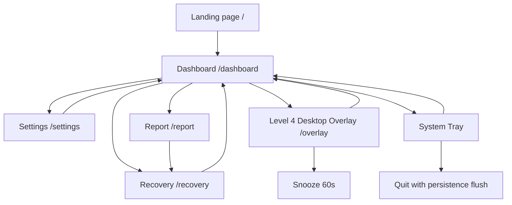
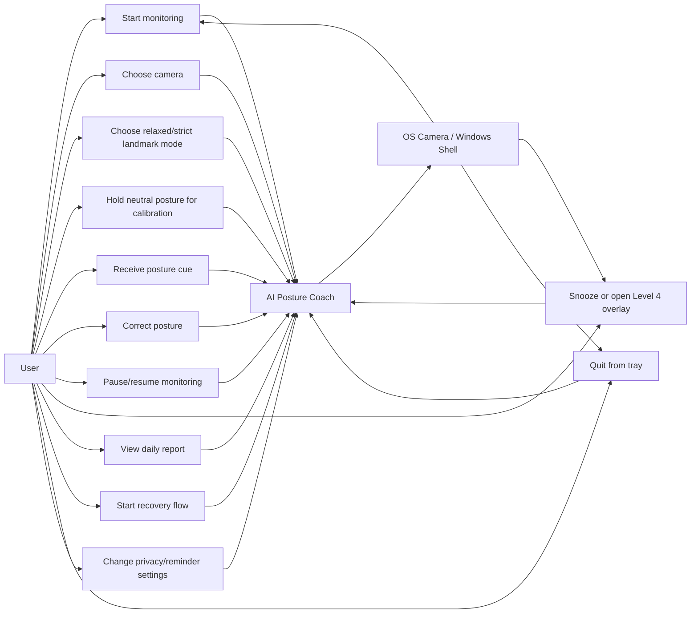
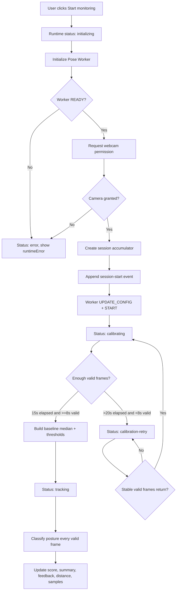
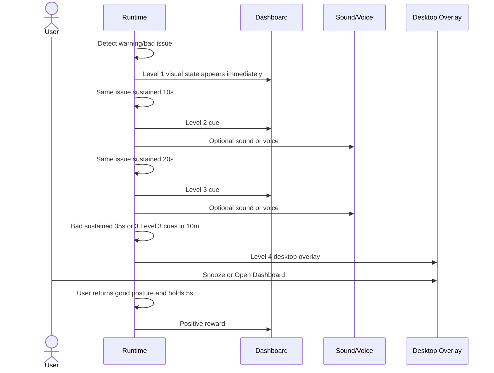
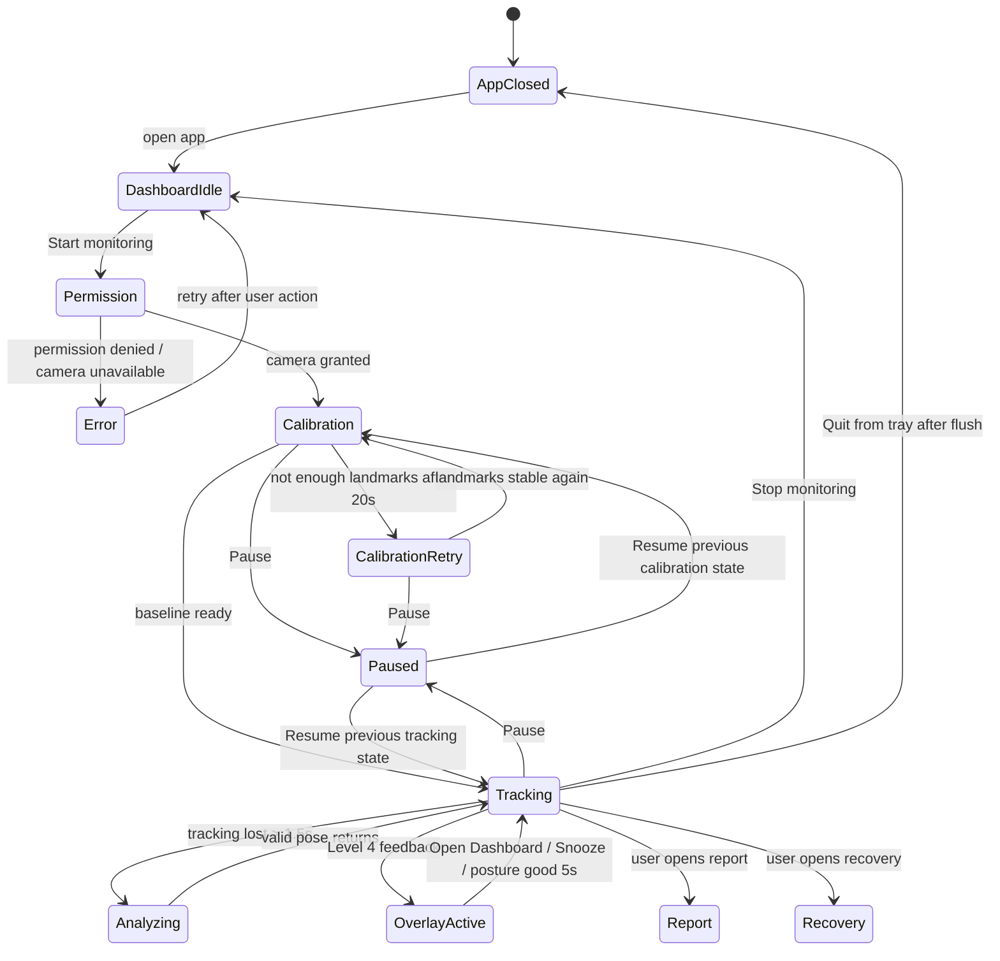
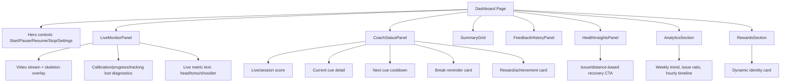
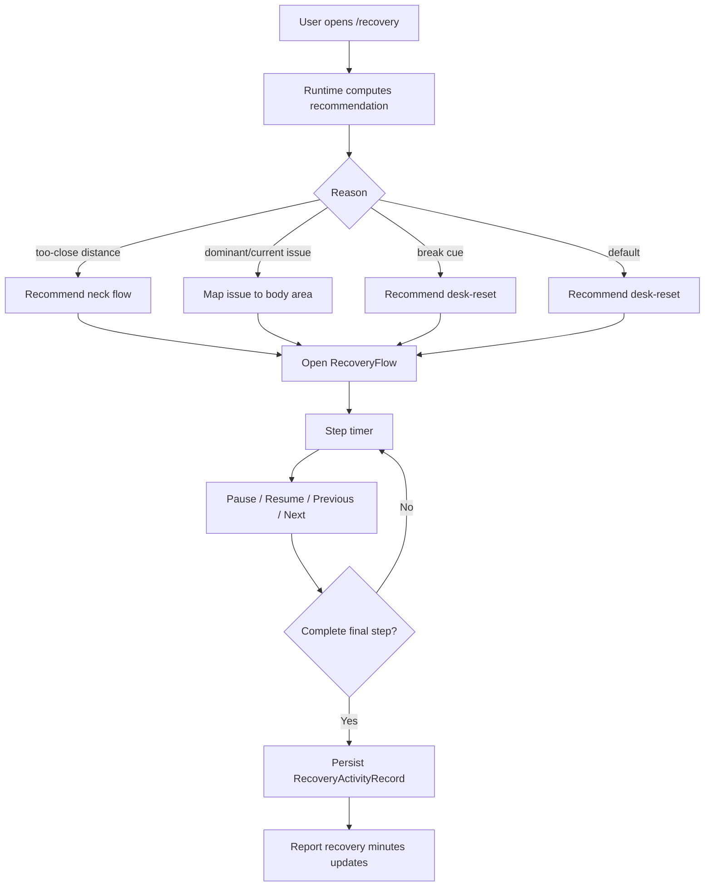
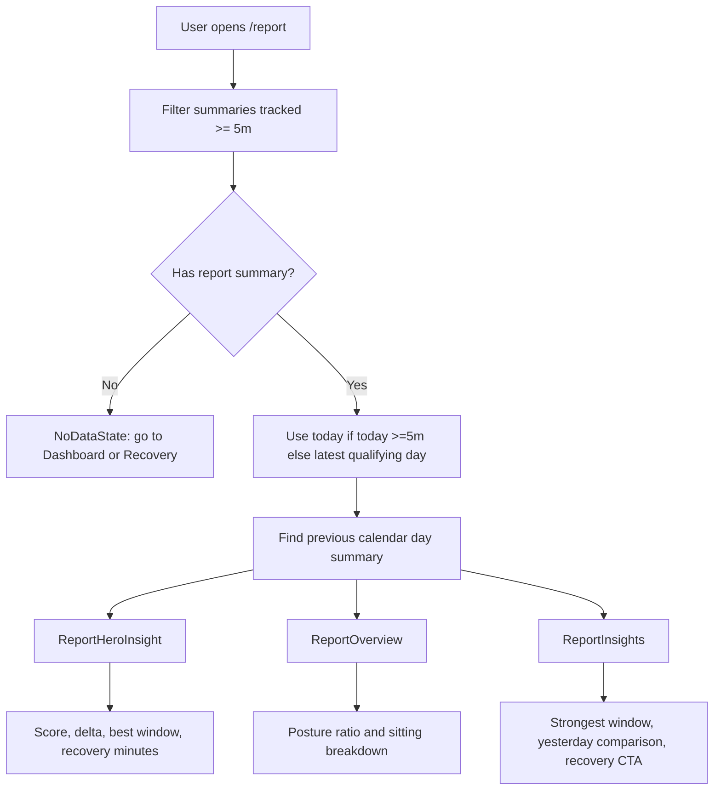
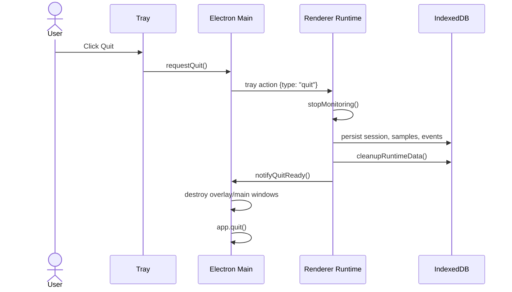

# AI Posture Coach - User Diagram And User Flow

> Generated from source review of `D:\Code\AI_Posture_Coach`.

## 1. Purpose

Tài liệu này mô tả cách người dùng đi qua sản phẩm AI Posture Coach từ lúc mở app, bật camera, calibration, theo dõi tư thế, nhận feedback, nghỉ giải lao, tập recovery, xem report, thay đổi settings và quit app. Nội dung bám theo source code hiện tại, không phải spec lý thuyết riêng.

## 2. Primary User

| User group | Context | Need |
| --- | --- | --- |
| Sinh viên | Học/lập trình nhiều giờ trên laptop | Được nhắc tư thế sai mà không phải tự quan sát liên tục |
| Lập trình viên | Làm việc 6-10 tiếng/ngày, hay forward head/rounded shoulders | Feedback nhẹ, score, report và break/recovery cue |
| Nhân viên văn phòng | Ngồi máy tính lâu, cần wellness loop riêng tư | Local-first posture tracking và guided reset |

## 3. User-Facing Product Map

## 4. Use Case Diagram

## 5. Main User Journey

| Step | User action | System response | Data effect |
| --- | --- | --- | --- |
| 1 | Mở app desktop | Electron mở main window tại `/dashboard` | Load preferences từ localStorage và runtime snapshot từ IndexedDB |
| 2 | Bấm `Start monitoring` | Runtime init worker, request camera permission, start hidden video stream | Append `session-start` event |
| 3 | Chờ calibration | UI hiện calibration progress, camera label, valid/processed frames, tracking lost reason nếu có | Calibration accumulator thu validMs và metrics arrays |
| 4 | Calibration đủ điều kiện | Runtime tạo baseline median và thresholds | Monitoring status sang `tracking` |
| 5 | Làm việc bình thường | App chạy frame loop 15 FPS target, worker process pose | Update live metrics, posture state, session duration |
| 6 | Tư thế lệch nhẹ | Dashboard chuyển state warning/bad và cue text | Append `state-change` nếu state đổi |
| 7 | Cùng issue kéo dài 10s | Level 2 feedback | Append `feedback`, tăng intervention count |
| 8 | Cùng issue kéo dài 20s | Level 3 feedback | Update Level 3 rolling window, break suppression clock |
| 9 | Bad posture 35s hoặc 3 Level 3 trong 10 phút | Level 4 overlay desktop | Show overlay, tăng overlay count |
| 10 | Sửa lại posture và giữ good 5s | Positive reward nếu có pending intervention và micro celebration on | Append `correction-success`, tăng correction count |
| 11 | Tracked time đạt reminder threshold | Break reminder nếu enabled và gần đây không có Level 3/4 | Append `break-reminder` |
| 12 | Khoảng cách camera lệch 5s | Distance advisory too-close/too-far | Append `distance-warning`, không trừ score |
| 13 | Bấm Stop hoặc Quit | Runtime finalize session, persist records, cleanup | Rebuild daily summary, achievements, snapshot |
| 14 | Vào Report | UI lấy summary ngày hiện tại hoặc ngày gần nhất tracked >=5m | Hiện score, best/worst hour, issue, recovery minutes |
| 15 | Vào Recovery | UI recommend bài tập theo current/dominant issue hoặc distance/break | Completion persist recovery activity metadata |

## 6. Monitoring Flow Diagram

## 7. Calibration User Flow

| UI status | What user sees | Likely user action |
| --- | --- | --- |
| `requesting-permission` | Browser/Electron asks camera permission | Grant camera access |
| `calibrating` | Calibration percent, camera label, valid frame count | Sit neutrally and keep face/shoulders visible |
| `calibration-retry` in relaxed mode | Message about needing face/shoulders stable | Recenter body, adjust lighting/camera |
| `calibration-retry` in strict mode | Message saying strict mode needs face, shoulders, hips | Move back so camera sees upper body and hips |
| `tracking` | Live posture card, skeleton overlay, score starts after next valid frame | Work normally |
| `error` | Runtime error message in monitor panel | Check camera permission/device or choose another camera |

## 8. Feedback Ladder User Flow

## 9. User State Machine

## 10. Dashboard Screen Diagram

## 11. Settings User Flow

| Setting | User action | Runtime effect |
| --- | --- | --- |
| Sensitivity | Move slider 20..100 | Rebuild thresholds if baseline exists |
| Feedback mode | Choose gentle/sound/voice | Changes cue output channel |
| Reminder preset | Choose 45/50/60 minutes | Updates next reminder tracked threshold |
| Micro celebrations | Toggle on/off | Controls positive reward cue visibility |
| Theme | Choose midnight/pearl/system | Updates document theme |
| Camera | Select device or default | Next camera request uses selected `deviceId.exact`, fallback if missing |
| Landmark mode | Choose relaxed/strict | Worker config updates; active session recalibrates |
| Local processing | Toggle | If off, live inference continues but session persistence is skipped |
| Reminders enabled | Toggle | Enables/disables break reminder trigger |

## 12. Recovery User Flow

## 13. Report User Flow

## 14. Tray And Quit User Flow

If renderer does not acknowledge, main process uses a bounded fallback timeout of 10 seconds.

## 15. User Error And Edge-Case Matrix

| Scenario | What user sees | System behavior |
| --- | --- | --- |
| Camera permission denied | Runtime error / camera off message | Status becomes `error` |
| Selected camera missing | App still starts with fallback camera | Clears selected camera preference |
| Virtual camera selected by OS | User can open Settings and choose real webcam | `cameraDeviceId` saved to preferences |
| Face/shoulders not visible | Calibration/analyzing reason says landmarks missing | No scoring until valid frames |
| Hips not visible in relaxed mode | UI notes torso metric paused | Score normalizes active metric weights |
| Hips not visible in strict mode | Calibration retry asks user to move back | Strict requires torso landmarks |
| App window minimized during monitoring | Window hides to tray | Monitoring continues |
| Pause during monitoring | Status paused | Worker stopped, late frames ignored, no score gap counted |
| Resume after long pause | Returns to previous state | Timestamps reset to avoid time jump |
| Worker crash | Runtime error | Session finalizes and stream/overlay release |
| Sitting too close/far | Distance advisory cue | Does not reduce posture score |
| User returns to good posture | Positive reward after 5s if eligible | Correction success event persisted |
| User crosses midnight while monitoring | Logical session rolls over | New dayKey starts for samples/events/summary |

## 16. Product Interaction Rules

| Rule | User-facing effect |
| --- | --- |
| Calibration first | User cannot get a score until baseline is created |
| Gentle by default | Feedback starts visually and avoids heavy interruption unless issue persists |
| Local-first by default | User data stays in browser/Electron local storage |
| No video save | User can trust that camera stream is only runtime input |
| Relaxed mode default | Laptop webcam users can still score without visible hips |
| Strict mode optional | User can demand fuller torso metric when camera framing supports it |
| Break reminders use tracked time | Long pause, sleep, or tracking lost gap does not trigger fake reminders |
| Recovery is deterministic/local | Recommendations come from issue/distance/history rules, not cloud AI |

## 17. Screen-Level User Entry Points

| Entry point | Main CTA | Secondary actions |
| --- | --- | --- |
| Landing `/` | Go to dashboard/demo | Learn privacy/features |
| Dashboard `/dashboard` | Start monitoring | Pause, resume, stop, settings, recovery suggestions |
| Settings `/settings` | Tune runtime behavior | Camera refresh, landmark mode, privacy/reminders |
| Report `/report` | Review latest qualifying day | Open recovery recommendation |
| Recovery `/recovery` | Start recommended reset | Filter by body area, open shoulder flow, complete guided flow |
| Overlay `/overlay` | Open Dashboard | Snooze 60s |

## 18. User Data Objects

| Object | Created by user/system action | Used by |
| --- | --- | --- |
| Runtime preferences | Settings changes | Runtime thresholds, feedback, reminders, camera, privacy |
| SessionRecord | Stop, worker error, day rollover | Daily summary, score, report, retention |
| PoseSampleRecord | 1Hz valid tracked frame | Hourly trend, report, analytics |
| PostureEventRecord | Session/cue/break/distance/reward/snooze | Feedback history, audit trail |
| DailySummary | Rebuilt after session persistence | Dashboard, report, streak, achievements, identity |
| RuntimeAchievement | Computed from summaries | Rewards section |
| RecoveryActivityRecord | Recovery flow completion | Report recovery minutes, recommendation rotation |

## 19. Recommended Demo Script

| Step | Demo action | Expected result |
| --- | --- | --- |
| 1 | Run Electron app and open dashboard | App opens `/dashboard` |
| 2 | Click Start monitoring | Camera permission requested, calibration UI appears |
| 3 | Keep face/shoulders visible for 15s | Status becomes tracking, score starts after valid tracked frame |
| 4 | Lean head forward for 10s | Level 2 cue appears |
| 5 | Continue issue to 20s | Level 3 cue appears |
| 6 | Force bad posture long enough | Level 4 overlay appears |
| 7 | Click Snooze 60s | Overlay hides and snooze event is recorded |
| 8 | Return to good posture for 5s | Reward cue appears if micro celebrations enabled |
| 9 | Move too close to screen for 5s | Distance advisory appears, score remains high if posture good |
| 10 | Open Recovery from dashboard | Recommended flow is selected by current/dominant issue |
| 11 | Complete flow | Recovery minutes appear in report for that day |
| 12 | Stop monitoring | Session persists, report has loaded data if tracked >=5m |
